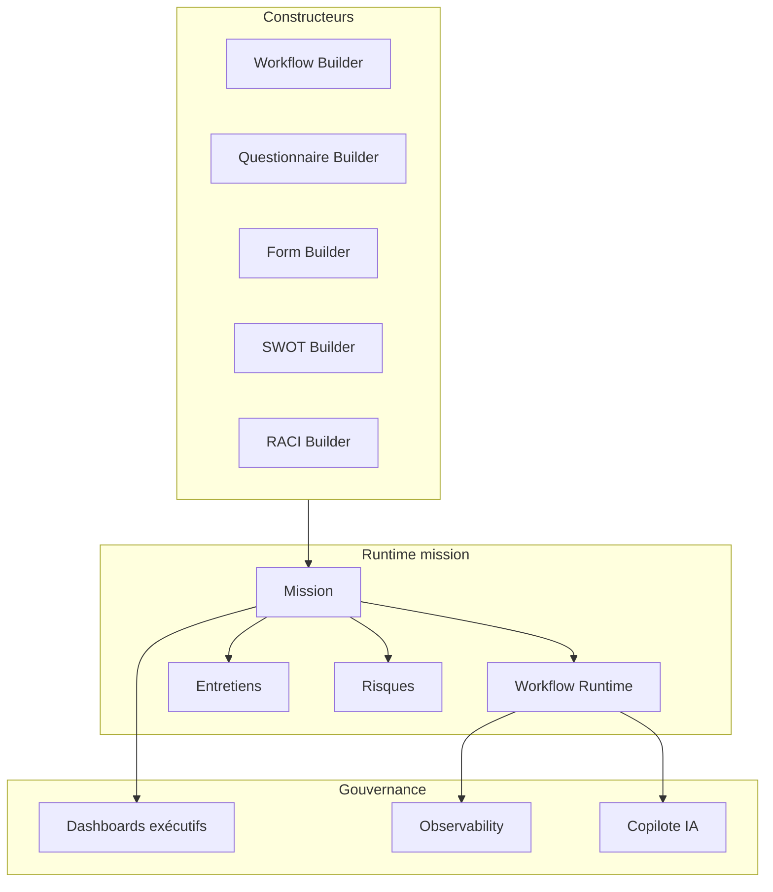

# Documentation technique — Plateforme d'audit DGCPT

Documentation opérationnelle de la plateforme enterprise (missions, workflows, questionnaires, risques, SWOT/RACI, IA copilote, gouvernance et sécurité).

## Public cible

| Document | PDF (lecture) | Public |
|----------|---------------|--------|
| Guide utilisateur | [PDF](pdf/01-guide-utilisateur.pdf) · [MD](guides/01-guide-utilisateur.md) | Auditeurs, agents de mission, vérificateurs |
| Guide administrateur | [PDF](pdf/02-guide-administrateur.pdf) · [MD](guides/02-guide-administrateur.md) | Super admins, admins IAM, responsables de pôle |
| Guide workflows | [PDF](pdf/03-guide-workflows.pdf) · [MD](guides/03-guide-workflows.md) | Concepteurs de processus, référents méthodologie |
| Guide IA Copilote | [PDF](pdf/04-guide-ia-copilot.pdf) · [MD](guides/04-guide-ia-copilot.md) | Tous utilisateurs autorisés + admins IA |
| Manuel procédures sécurité | [PDF](pdf/05-manuel-procedures-securite.pdf) · [MD](guides/05-manuel-procedures-securite.md) | RSSI, admins sécurité, exploitation |
| Guide exploitation | [PDF](pdf/06-guide-exploitation.pdf) · [MD](guides/06-guide-exploitation.md) | Équipe technique, exploitation, support N2 |

> Les PDF sont formatés A4 (en-tête DGCPT, tableaux lisibles). Pour régénérer après modification d’un guide : `powershell -File docs/tools/build-guides-pdf.ps1`

## Prérequis généraux

- Compte **approuvé** et **actif**
- Navigateur récent (Chrome, Edge, Firefox)
- URL de la plateforme fournie par l'administration
- Rôle institutionnel adapté à la fonction (voir guide admin)

## Journaux de déploiement

- [Synchronisation GitHub / VPS et livraison DGCPT — 20 juillet 2026](deployments/2026-07-20-main-vps.md)

## Architecture fonctionnelle (vue d'ensemble)

## Conventions dans les guides

- **Chemin** : URL relative à la racine (ex. `/workflow-builder`)
- **Menu** : libellé tel qu'affiché dans la barre latérale DGCPT
- Les actions marquées **Validation humaine** ne sont jamais automatiques (IA, approbations)

## Versions documentées

Alignée sur les sprints enterprise : workflows dynamiques, SWOT/RACI, hardening tenant/sécurité, copilote IA assistif.
