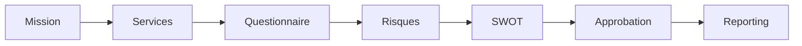

# Guide workflows — Création, publication et runtime

Guide pas à pas pour **concevoir**, **publier** et **exécuter** un workflow d'audit sur la plateforme DGCPT.

---

## 1. Concepts clés

| Terme | Définition |
|-------|------------|
| **WorkflowTemplate** | Modèle versionné (brouillon → publié → archivé) |
| **Stage (étape)** | Unité du parcours : questionnaire, formulaire, SWOT, etc. |
| **Transition** | Lien orienté entre deux étapes |
| **WorkflowInstance** | Exécution du workflow sur **une mission** |
| **Runtime** | Interface opérationnelle `/missions/{id}/workflow/runtime` |

---

## 2. Types d'étapes disponibles

| Type technique | Libellé | Usage typique |
|----------------|---------|---------------|
| `mission` | Mission | Contexte / initialisation |
| `service_selection` | Services | Choix des services audités |
| `questionnaire` | Questionnaires | Entretien structuré |
| `form` | Formulaire | Saisie libre structurée |
| `risk_capture` | Capture de risque | Identification risques |
| `heatmap` | Cartographie | Visualisation risques |
| `document_review` | Revue documentaire | Pièces jointes |
| `approval` | Approbation | Validation hiérarchique |
| `action_plan` | Plan d'action | Suivi correctifs |
| `reporting` | Reporting | Rapport final |
| `swot_analysis` | Analyse SWOT | Matrice forces/faiblesses |
| `swot_validation` | Validation SWOT | Relecture SWOT |
| `raci_assignment` | Affectation RACI | Matrice responsabilités |
| `raci_validation` | Validation RACI | Validation RACI |
| `custom` | Personnalisé | Extension |

---

## 3. Créer un workflow — pas à pas

### Phase A — Préparer les dépendances (recommandé)

Avant de lier des étapes, créez si nécessaire :

1. **Questionnaire** : `/questionnaire-builder` → publier le modèle.
2. **Formulaire** : `/form-builder` → publier le modèle.
3. **SWOT** : `/swot-builder` → catégories + entrées.
4. **RACI** : `/raci-builder` → rôles + affectations types.

> Les modèles **publiés** sont sélectionnables dans l'éditeur d'étapes.

---

### Phase B — Créer le brouillon du workflow

**Étape 1** — Ouvrir le builder

1. Menu latéral → **Workflows** (ou URL `/workflow-builder`).
2. Vous voyez la **Bibliothèque des workflows** et le formulaire « Créer un brouillon ».

**Étape 2** — Renseigner les métadonnées

| Champ | Obligatoire | Exemple |
|-------|-------------|---------|
| Nom | Oui | `Audit cybersécurité 2026` |
| Slug | Non (auto) | `audit-cyber-2026` |
| Code | Recommandé | `WF_CYBER` |
| Département | Non | Pôle SI — vide = transversal |

3. Cliquez **Créer** (POST vers `workflow-builder.store`).
4. Le système crée un template en statut **`draft`**.

**Étape 3** — Ouvrir l'éditeur visuel

1. Dans la liste, cliquez **Éditer** sur le brouillon.
2. URL : `/workflow-builder/{template_id}/edit`.
3. L'écran affiche :
   - **Canvas** (graphe des étapes),
   - **Panneau latéral** (propriétés de l'étape sélectionnée),
   - Liste des transitions.

---

### Phase C — Ajouter et configurer les étapes

**Étape 4** — Créer la première étape

1. Dans l'éditeur, **Ajouter une étape** (formulaire panneau ou bouton dédié).
2. Renseignez :
   - **Nom** : ex. `Sélection des services`
   - **Type** : `service_selection`
   - **Ordre** : `10`
   - **Mode d'exécution** : séquentiel / parallèle selon besoin
3. Enregistrez → POST `workflow-builder/{template}/stages`.

**Étape 5** — Ajouter une étape questionnaire

1. Nouvelle étape, type **`questionnaire`**.
2. Sélectionnez le **QuestionnaireTemplate** publié.
3. Options : obligatoire, délai, rôles autorisés si configurés.
4. Enregistrez.

**Étape 6** — Ajouter une étape formulaire

1. Type **`form`**.
2. Liez le **FormTemplate** publié.
3. Enregistrez.

**Étape 7** — Ajouter capture risques + heatmap

1. Étape `risk_capture` — collecte des risques identifiés.
2. Étape `heatmap` — visualisation cartographie (runtime).

**Étape 8** — Ajouter SWOT (optionnel)

1. Étape `swot_analysis` → lier **SwotTemplate**.
2. Étape `swot_validation` pour relecture superviseur.

**Étape 9** — Ajouter RACI (optionnel)

1. Étape `raci_assignment` → **RaciTemplate**.
2. Étape `raci_validation`.

**Étape 10** — Approbation et clôture

1. Étape `approval` :
   - Sélectionner le **rôle institutionnel** approbateur (ex. inspecteur_services).
2. Étape `reporting`.
3. Optionnel : `action_plan` avant reporting.

**Étape 11** — Disposer le canvas

1. Glissez les blocs pour clarifier le parcours.
2. PATCH `workflow-builder/stages/{stage}/layout` enregistre les coordonnées.
3. Vérifiez l'ordre logique (`sort_order`).

---

### Phase D — Définir les transitions

**Étape 12** — Relier les étapes

Pour chaque passage d'une étape à la suivante :

1. **Ajouter une transition**.
2. **From** : étape source.
3. **To** : étape cible.
4. Libellé optionnel : `Après entretien`, `Si approuvé`, etc.
5. POST `workflow-builder/{template}/transitions`.



**Étape 13** — Vérifier la cohérence

Contrôlez :

- [ ] Au moins **1 étape**
- [ ] Nom et code renseignés
- [ ] Étapes `approval` avec rôle si requis
- [ ] Pas d'étape orpheline (sans transition entrante/sortante sauf début/fin)
- [ ] Templates liés existent et sont actifs

---

### Phase E — Publier le workflow

**Étape 14** — Lancer la publication

1. Dans l'éditeur ou la liste, cliquez **Publier**.
2. POST `/workflow-builder/templates/{template}/publish`.
3. Le service `WorkflowPublishingService` valide la structure.

**Étape 15** — Résultats possibles

| Résultat | Action |
|----------|--------|
| Succès | Statut → `published`, `active = true`, anciennes versions `deprecated` |
| Erreurs | Corriger les messages affichés (étapes manquantes, transitions, etc.) |

**Étape 16** — Modifier après publication

- Un template **publié est immuable**.
- Toute modification crée automatiquement un **nouveau brouillon** (clone) via `ensureEditableDraft`.
- Republiez la nouvelle version quand prêt.

**Étape 17** — Archiver (fin de vie)

1. POST `workflow-builder/templates/{template}/archive`.
2. Le modèle n'est plus proposé aux nouvelles missions.

---

## 4. Attacher un workflow à une mission

### Automatique

À la création de mission, `WorkflowCompatibilityService` peut instancier le workflow par défaut du département.

### Manuel / reprise

1. Fiche mission → action workflow si disponible.
2. Ou runtime : première visite `/missions/{id}/workflow/runtime` déclenche l'instanciation.

---

## 5. Exécuter le runtime — pas à pas

**Étape 1** — Ouvrir le runtime

- URL : `/missions/{mission}/workflow/runtime`
- Ou menu **Runtime workflows** → sélectionner la mission.

**Étape 2** — Lire le tableau de bord runtime

- Progression %, timeline, feed d'activité.
- Étape courante mise en évidence sur le graphe.

**Étape 3** — Compléter l'étape courante

| Type d'étape | Action utilisateur |
|--------------|-------------------|
| Questionnaire | Ouvrir entretien lié ou formulaire intégré |
| Form | Remplir champs → Soumettre |
| SWOT | Saisie matrice → Analyser |
| RACI | Affectations → Valider |
| Approval | Approuver / Rejeter avec commentaire |

POST : `/missions/{mission}/workflow/runtime/stages/{stage}`

**Étape 4** — Actions superviseur (si autorisé)

POST `/missions/{mission}/workflow/runtime/actions` :

| Action | Effet |
|--------|-------|
| `approve` | Valide l'étape |
| `reject` | Rejette avec commentaire |
| `skip` | Ignore (traçabilité) |
| `retry` | Relance |
| `rollback` | Retour étape antérieure |
| `reopen` | Réouvre le workflow |

> Toutes ces actions sont **signées et auditées** (enterprise hardening).

**Étape 5** — Fin de parcours

- Dernière étape validée → instance **terminée** ou mission prête pour clôture institutionnelle.

---

## 6. Dashboard et observabilité workflow

| Page | URL | Usage |
|------|-----|-------|
| Dashboard runtime | `/workflows/dashboard` | Vue multi-missions |
| Observability center | `/workflows/observability` | Santé, files, projections, erreurs |

Liens enterprise : `/observability/enterprise/health`, `/queues`, etc. (admins).

---

## 7. Checklist publication

```
[ ] Brouillon créé avec nom/code
[ ] ≥ 1 étape configurée
[ ] Templates questionnaire/form/SWOT/RACI publiés et liés
[ ] Transitions complètes
[ ] Rôles d'approbation définis
[ ] Test sur mission pilote en runtime
[ ] Publication réussie
[ ] Communication aux équipes du pôle
```

---

## 8. Erreurs fréquentes

| Message / symptôme | Cause | Solution |
|--------------------|-------|----------|
| Publication refusée | Structure invalide | Voir liste erreurs validation |
| Étape vide au runtime | Template non lié | Republier étape avec bon template |
| Accès refusé mission | Isolation tenant | Vérifier département utilisateur |
| Double instance | Ré-attachement | Support exploitation |

---

## 9. Voir aussi

- [Guide utilisateur](01-guide-utilisateur.md)
- [Guide IA](04-guide-ia-copilot.md) — étapes SWOT/RACI + suggestions
- [Manuel sécurité](05-manuel-procedures-securite.md) — traçabilité des transitions
